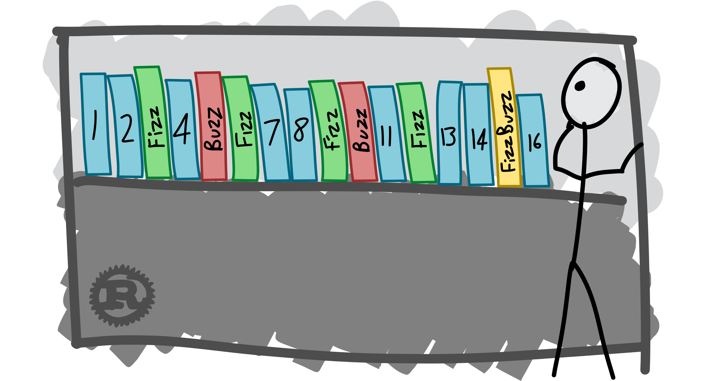
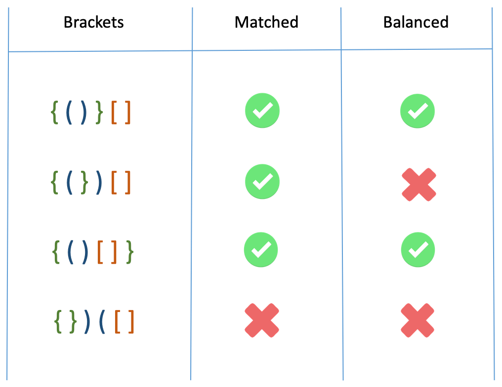

# Coding puzzles playground 

## 1. Balanced Braces

Conditions

Given a string containing brackets, determine if all brackets have a matching counterpart. 
If all brackets in the string form balanced pairs, return true. If not, return false 
 

